## Setting up a new project
To set up a brand new Xcode project using UIKit on the Apple Watch:

1. Create a new **iOS App with WatchKit App** project:

  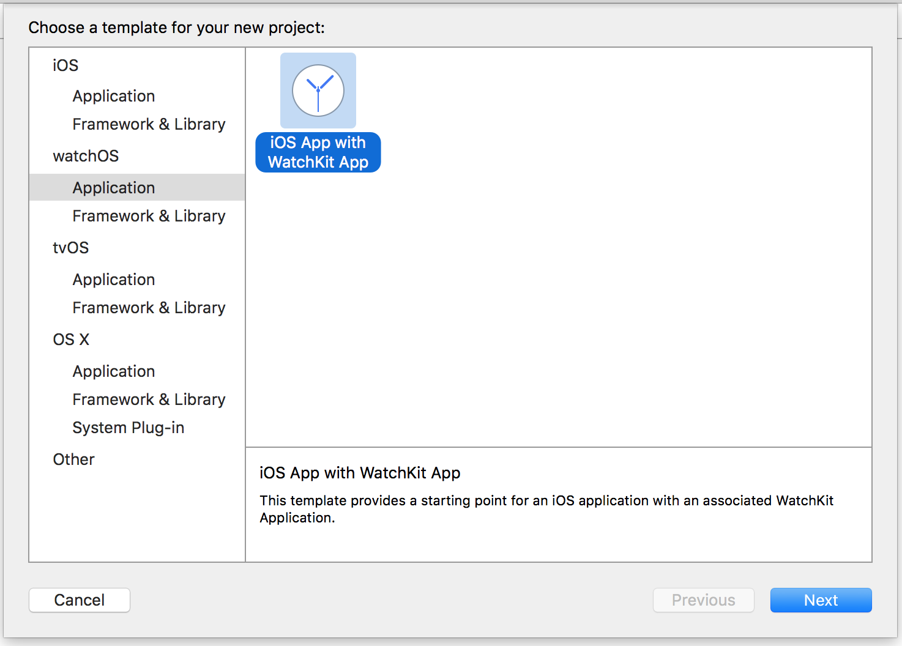

  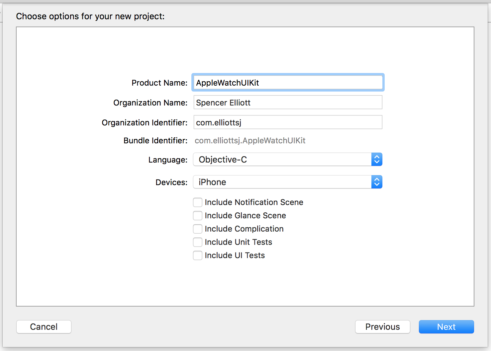

  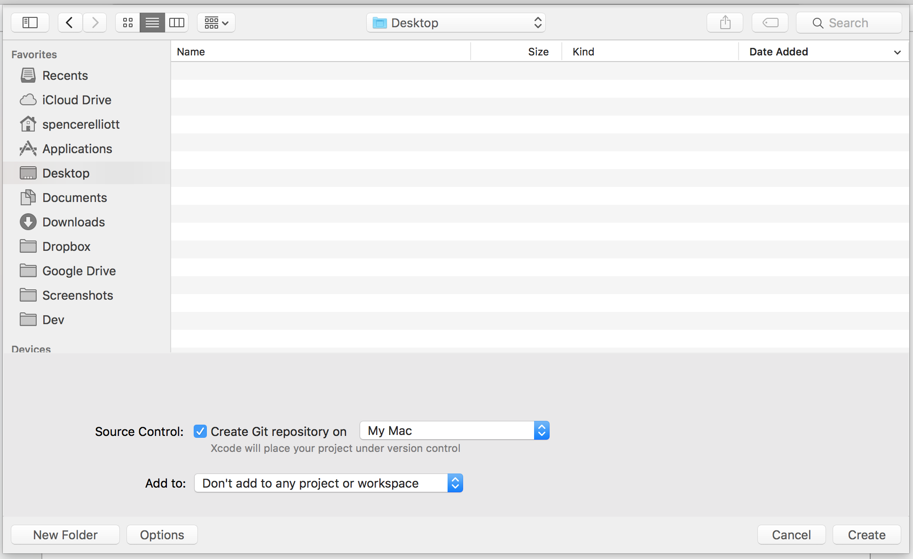

2. Add a **Watch Framework** target:

  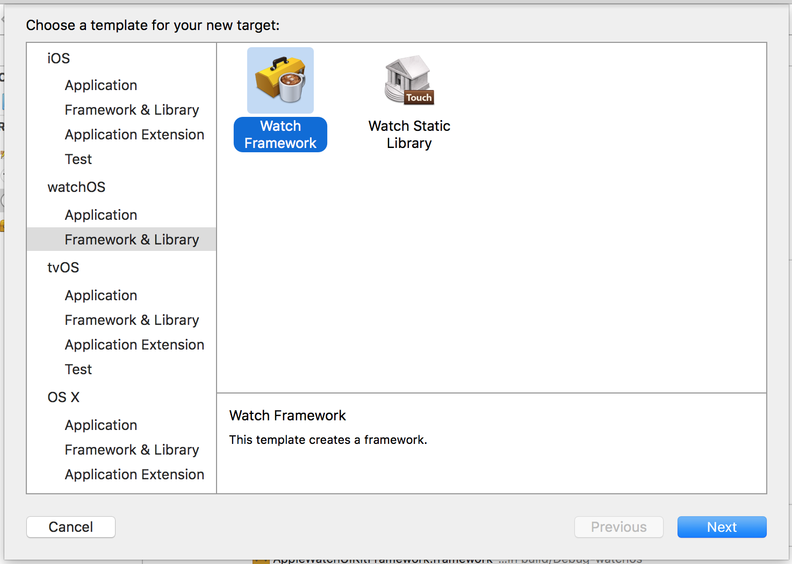

  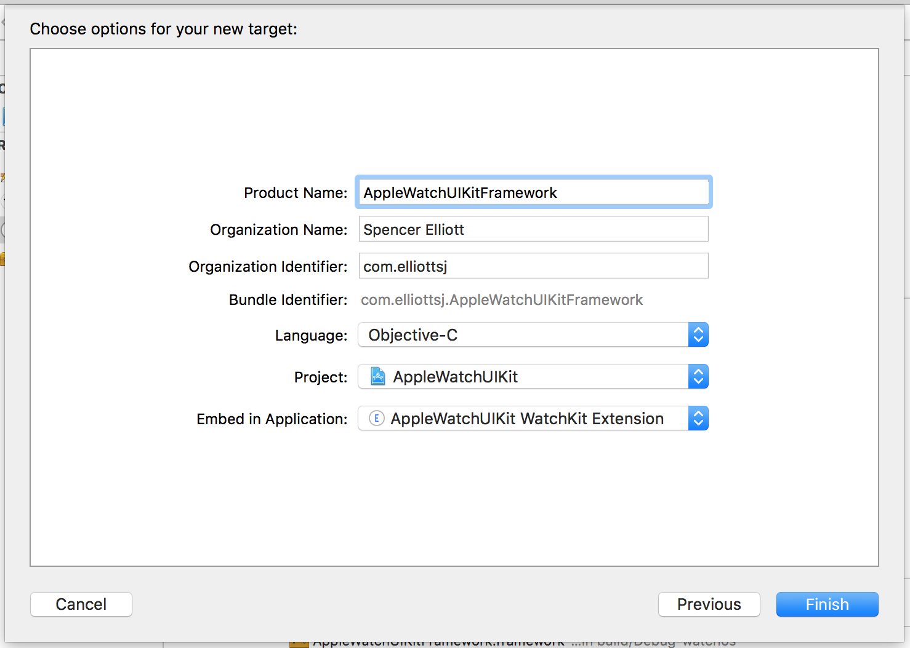

3. Add **main.m**, **AppDelegate.h**, and **AppDelegate.m** to the new target:

  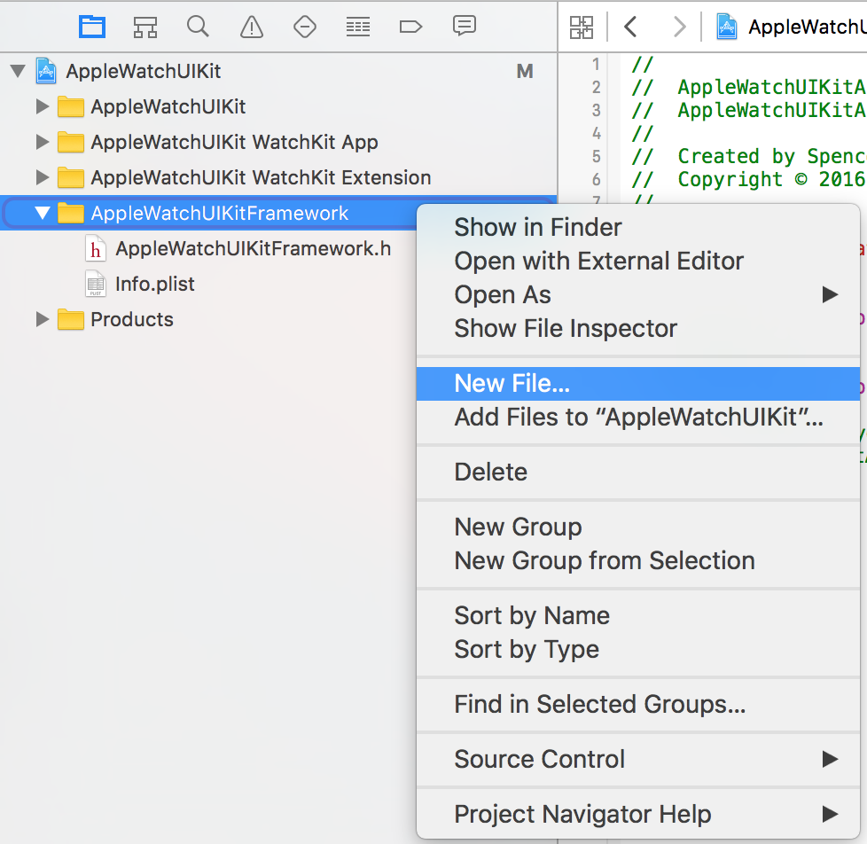

  **main.m**:

  

  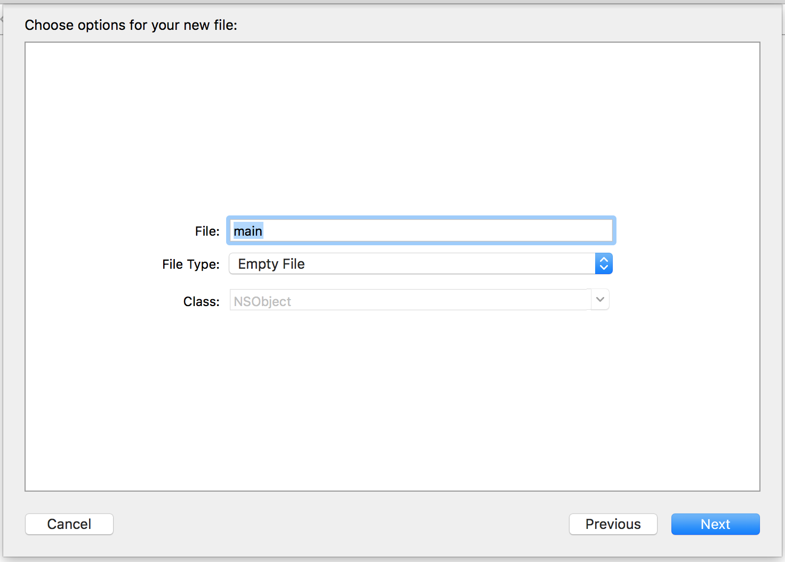

  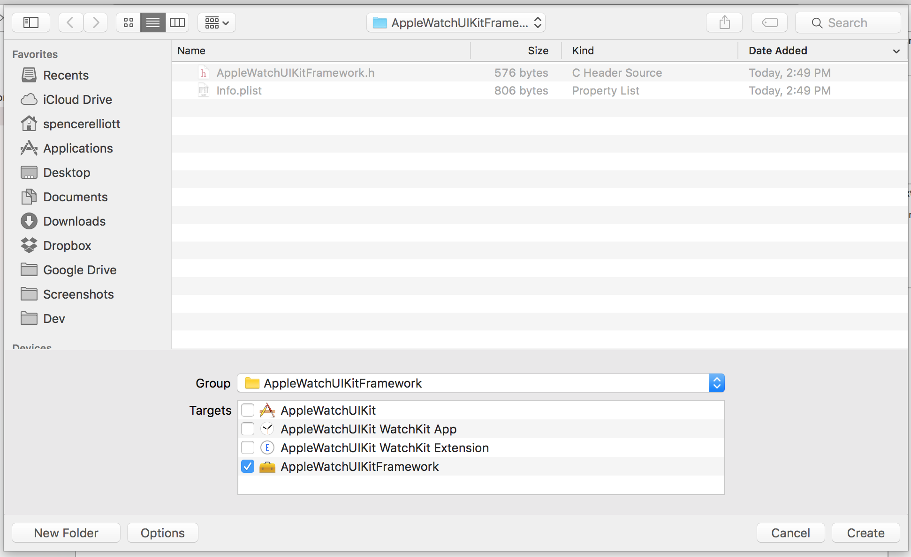

  ```objc
  #import <UIKit/UIKit.h>
  #import "AppDelegate.h"

  void __attribute__((constructor)) injected_main()
  {
      @autoreleasepool {
          UIApplicationMain(0, nil, @"UIApplication", NSStringFromClass([AppDelegate class]));
      }
  }

  ```

  **AppDelegate.h**:

  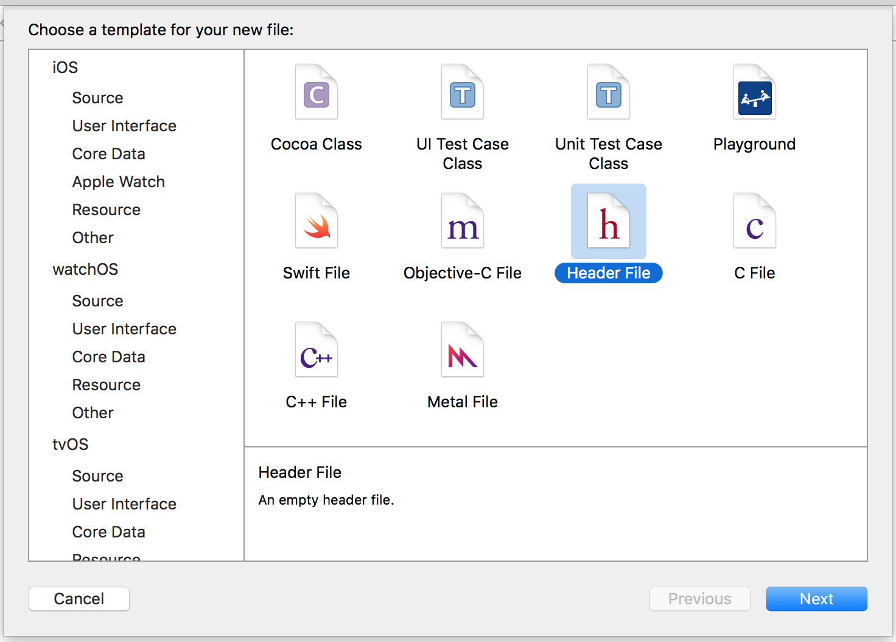

  

  ```objc
  #import <UIKit/UIKit.h>

  @interface AppDelegate : UIResponder <UIApplicationDelegate>

  @property (strong, nonatomic) UIWindow *window;

  @end
  ```

  **AppDelegate.m**:

  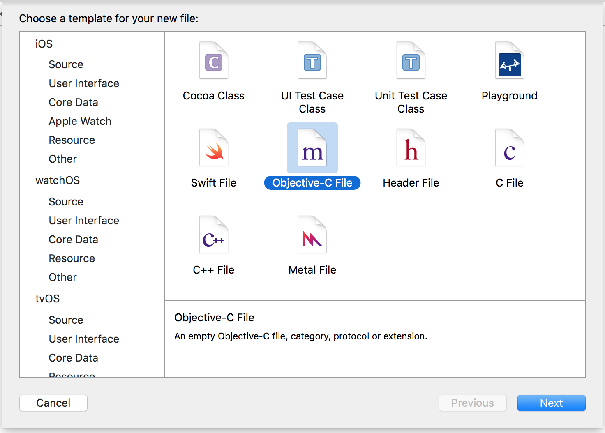

  

  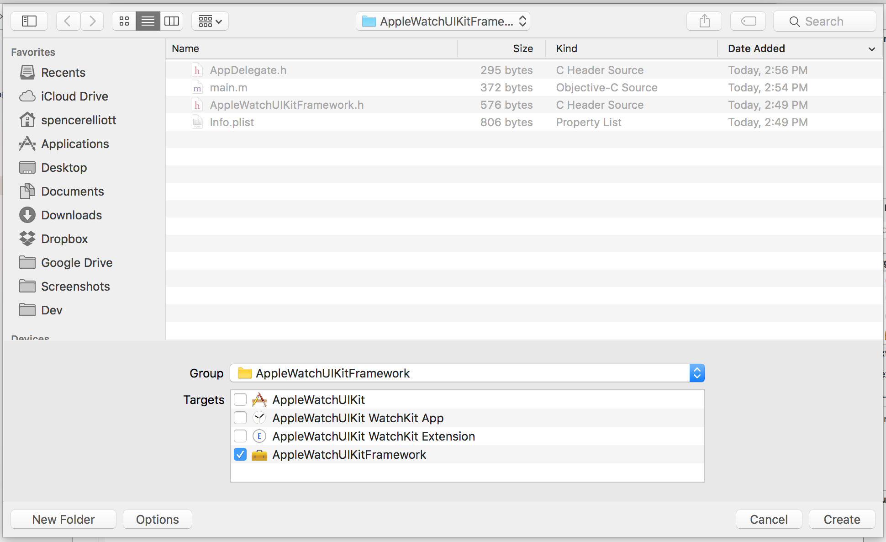

  ```objc
  #import "AppDelegate.h"

  @interface AppDelegate ()

  @end

  @implementation AppDelegate


  - (BOOL)application:(UIApplication *)application didFinishLaunchingWithOptions:(NSDictionary *)launchOptions
  {
      // Initialize `self.window`. See AppleWatchUIKitFramework/AppDelegate.m for an example
      return YES;
  }

  @end

  ```

4. Patch WatchOS frameworks [as described in *Running this example*](RunningThisExample.md#patch-watchos-platform-frameworks).

5. Create a build script to patch the WatchKit app so it loads the framework target's executable. See [AppleWatchUIKit/build.sh](/AppleWatchUIKit/build.sh) for an example.
